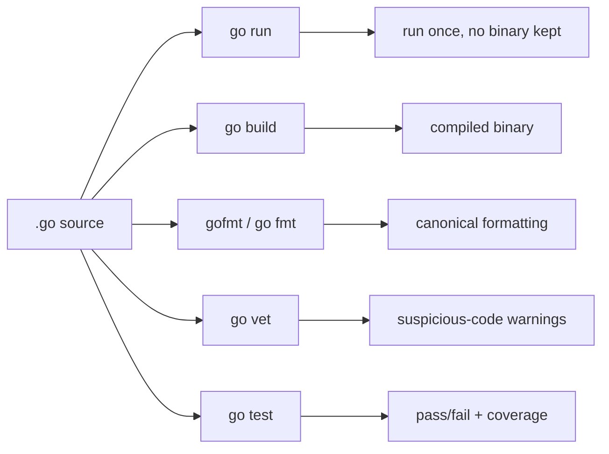

# 01 — Foundations

## TL;DR
Go is compiled, statically typed, and garbage-collected, with a deliberately
small syntax. Code lives in **packages**; an executable program is `package main`
with a `func main()`. The `go` tool is your entire workflow: build, run, format,
vet, test, manage dependencies. There are no unused imports or unused local
variables — the compiler rejects them, which keeps code clean by force.

## The toolchain

- `go run ./path` — compile + run, no binary left behind. For quick iteration.
- `go build ./...` — compile everything; `./...` means "this dir and all below".
- `gofmt` / `go fmt` — the one true format. Nobody argues about style in Go.
- `go vet` — flags likely mistakes the compiler allows (bad Printf verbs, etc.).
- `go test ./...` — runs `*_test.go` files.
- `go mod` — dependency + module management (`go.mod` pins the module + Go version).

## Concept files (read in order)
1. `01-hello/main.go` — the smallest program; packages, imports, `main`.
2. `02-variables-types/main.go` — `var` vs `:=`, basic types, zero values, constants.
3. `03-control-flow/main.go` — `if`, `for` (Go's only loop), `switch`.
4. `04-functions/main.go` — multiple returns, named returns, variadic, closures, `defer`.

## Key terms
- **Zero value** — every variable is initialized even without an explicit value:
  `0` for numbers, `""` for strings, `false` for bools, `nil` for pointers/slices/maps.
- **`:=`** — short declaration + type inference; only usable inside functions.
- **Exported** — identifiers starting with a Capital letter are public across packages.
- **`defer`** — schedules a call to run when the surrounding function returns.

## Common pitfalls
- Unused imports/locals are **compile errors**, not warnings.
- `:=` needs at least one *new* variable on the left; reusing all-existing names needs `=`.
- `for` is the only loop keyword — there is no `while` or `do`.
- Loop variables are per-iteration as of Go 1.22 (older gotcha with closures is gone,
  but still worth understanding — see `04-functions`).
