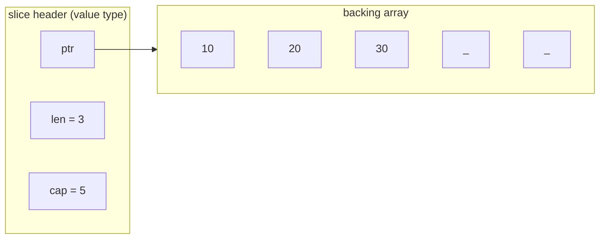

# 02 — Core data structures

## TL;DR
Arrays are fixed-size and rarely used directly. **Slices** are the workhorse:
a lightweight header (pointer, length, capacity) over a backing array. **Maps**
are Go's hash tables. **Strings** are immutable UTF-8 byte sequences — indexing
gives bytes, ranging gives runes (code points). **Pointers** exist but there's
no pointer arithmetic; they're for sharing/mutating, not for iteration tricks.
The recurring theme: slices and maps are *reference-like*, so copies share
underlying data — the source of most beginner bugs.

## Slice internals (why aliasing bites)

Two slices can point at the *same* backing array. Writing through one is
visible through the other. `append` may or may not allocate a new array
depending on capacity — that unpredictability is the classic gotcha.

## Concept files (read in order)
1. `01-arrays-slices/main.go` — arrays vs slices, len/cap, append growth, slicing, aliasing, copy.
2. `02-maps/main.go` — creation, comma-ok, delete, iteration randomness, nil-map read vs write.
3. `03-strings-runes/main.go` — bytes vs runes, ranging, utf8, []byte/[]rune conversions.
4. `04-pointers/main.go` — & and *, pointers to structs, nil, when (not) to use them.

## Key terms
- **Backing array** — the contiguous memory a slice points into.
- **Capacity** — how far a slice can grow (via re-slicing/append) before reallocation.
- **comma-ok** — `v, ok := m[k]` distinguishes "missing" from "present but zero".
- **rune** — an `int32` Unicode code point; a `string` is bytes, not runes.

## Common pitfalls
- **Slice aliasing:** `b := a[1:3]` shares memory with `a`; mutating `b[0]` changes `a[1]`.
- **append surprise:** if `cap` allows, `append` mutates the shared array in place;
  if not, it allocates and the alias breaks. Never rely on which happened.
- **nil map writes panic:** reading a nil map is fine (returns zero), *writing* panics.
  Always `make(map[K]V)` before writing.
- **`len(s)` on a string** is byte count, not character count. Use `utf8.RuneCountInString`.
- **Map iteration order is randomized** on purpose — never depend on it.
