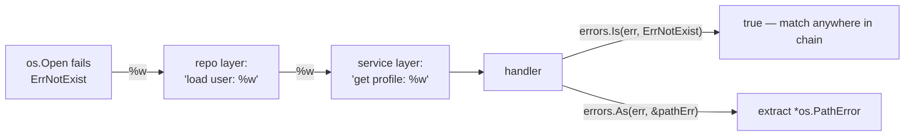

# 03 — Error handling

## TL;DR
In Go, **errors are ordinary values**, not exceptions. Functions that can fail
return an `error` as their last result; the caller checks it with `if err != nil`.
There is no `try/catch` for normal control flow. You add context as an error
travels up the stack by **wrapping** it with `fmt.Errorf("...: %w", err)`, then
callers inspect the chain with `errors.Is` (match a sentinel) or `errors.As`
(extract a typed error). `panic`/`recover` exist but are for *programmer bugs*
and truly unrecoverable situations — not routine failures.

## The error interface
It's just one method. Anything implementing it is an error.
```go
type error interface {
    Error() string
}
```

## Wrapping & unwrapping



Each `%w` adds a layer while keeping the original reachable. `errors.Is` walks
the chain looking for a specific sentinel value; `errors.As` walks it looking
for a specific concrete type and copies it out.

## Concept files (read in order)
1. `01-basics/main.go` — returning/checking errors, `errors.New`, `fmt.Errorf`, sentinels.
2. `02-wrapping/main.go` — `%w`, `errors.Is`, `errors.As`, unwrap chains.
3. `03-custom-errors/main.go` — custom error types, when to use them, `errors.As` extraction.
4. `04-panic-recover/main.go` — `panic`, `recover`, `defer`, and when NOT to use them.

## Key terms
- **Sentinel error** — a predeclared `var ErrX = errors.New("...")` compared with `errors.Is`.
- **Wrapping (`%w`)** — embed a cause inside a new error, preserving the chain.
- **`errors.Is(err, target)`** — is `target` anywhere in the chain? (value match)
- **`errors.As(err, &v)`** — is there a `v`-typed error in the chain? extract it. (type match)
- **`panic`** — abort the goroutine, run defers, crash unless recovered.

## Common pitfalls
- **`%v` vs `%w`:** `%v` formats the error into a string and *drops* the chain;
  `%w` preserves it. Use `%w` when you want callers to `Is`/`As` the cause.
- **Comparing error strings** (`err.Error() == "..."`) is fragile — use sentinels + `Is`.
- **Over-wrapping:** don't add `"error: "` noise at every level; add context that
  helps locate the failure ("load config %q: %w").
- **`panic` for ordinary errors** is a code smell — return an `error` instead.
- **`recover` only works inside a deferred function**, and only for the current goroutine.
